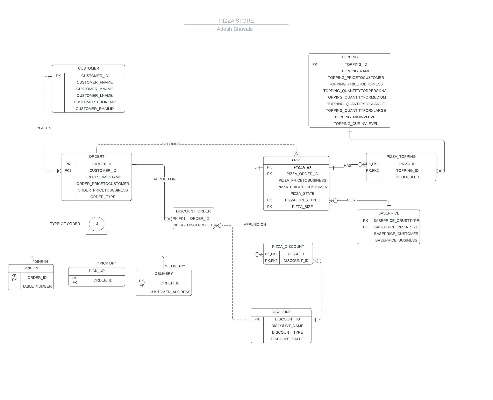

# PIZZA-R-US

## Overview
PIZZA-R-US is a database-driven Java application designed to handle operations for a pizza ordering system. The project is divided into three parts:
1. **ER Diagram**: Models the database schema.
2. **SQL Script**: Creates the database schema and populates it with initial data.
3. **Java Application**: Implements the business logic using JDBC to interact with the database.

The application supports features such as placing orders, managing toppings, discounts, and inventory, and generating reports.

---

## Screenshots
### ER Diagram

 </img>

---

## Features

### Core Functionalities
- **Add Order**: Create or update orders with details such as customer information, type of order (dine-in, delivery, pickup), and pricing.
- **Add Pizza**: Record pizzas linked to orders, including size, crust type, and pricing.
- **Manage Inventory**: Update inventory levels for toppings and generate inventory reports.
- **Apply Discounts**: Link discounts to pizzas and orders.
- **Complete Orders**: Mark orders as complete and update associated pizzas.
- **Reports**:
  - **Profit by Pizza**: Analyze profit margins for each pizza type.
  - **Profit by Order Type**: Analyze profit margins based on order types (dine-in, delivery, pickup).
  - **Topping Popularity**: View the most used toppings.

---

## Technologies Used

- **Java**: Core programming language for the application.
- **JDBC**: For database connectivity.
- **SQL**: Used to define and manipulate the database schema.
- **MySQL**: Relational database to store application data.

---

## Database Design

### ER Diagram
*(Insert ER Diagram here)*

The ER Diagram illustrates the relationships between entities such as `Order`, `Pizza`, `Customer`, `Topping`, and `Discount`.

### SQL Schema
The database schema includes the following tables:
- **ordert**: Stores order details.
- **pizza**: Stores pizza details associated with orders.
- **customer**: Stores customer information.
- **topping**: Tracks available toppings and their inventory levels.
- **discount**: Records available discounts.
- **bridges**:
  - `pizzatopping`: Links pizzas to their toppings.
  - `pizzadiscount`: Links pizzas to discounts.
  - `discountorder`: Links orders to discounts.

---

## Setup Instructions

### Prerequisites
- Java 8 or above
- MySQL Database
- JDBC Driver

### Steps
1. Clone the repository:
   ```bash
   git clone <repository-url>
   ```
2. Configure the database:
   - Execute the provided SQL script to set up the database schema and initial data.
   - Update the connection details in the `DBConnector` class (not provided here but assumed to manage database connections).
3. Compile and run the application:
   ```bash
   javac -d bin src/**/*.java
   java -cp "bin;path-to-mysql-connector.jar" cpsc4620.Main
   ```

---

## Key Classes and Methods

### `DBNinja`
The `DBNinja` class serves as the main interface between the application and the database. Key methods include:

- **Order Management**:
  - `addOrder(Order o)`: Adds or updates orders in the database.
  - `CompleteOrder(Order o)`: Marks an order as complete.

- **Pizza Management**:
  - `addPizza(Pizza p)`: Adds pizza details to the database.
  - `useTopping(Pizza p, Topping t, boolean isDoubled)`: Updates topping inventory and records pizza-topping associations.

- **Customer Management**:
  - `addCustomer(Customer c)`: Adds a customer to the database.
  - `getCustomerList()`: Retrieves a list of all customers in alphabetical order.

- **Reports**:
  - `printInventory()`: Prints the current inventory levels of all toppings.
  - `printProfitByPizzaReport()`: Prints the profit analysis for pizzas.
  - `printToppingPopReport()`: Prints the topping popularity report.

---

## Sample SQL Script
```sql
CREATE TABLE ordert (
    OrdertID INT AUTO_INCREMENT PRIMARY KEY,
    OrdertCustomerID INT,
    OrdertTimeStamp DATETIME,
    OrdertPriceToCustomer DECIMAL(10, 2),
    OrdertPriceToBusiness DECIMAL(10, 2),
    OrdertType VARCHAR(20),
    IsCompleted BOOLEAN
);

CREATE TABLE pizza (
    PizzaID INT AUTO_INCREMENT PRIMARY KEY,
    PizzaOrderID INT,
    PizzaPriceToBusiness DECIMAL(10, 2),
    PizzaPriceToCustomer DECIMAL(10, 2),
    PizzaState VARCHAR(20),
    PizzaCrustType VARCHAR(20),
    PizzaSize VARCHAR(20)
);

-- Add more table definitions here
```

---

## Execution

Run the application using the `Main` class, which provides a menu-driven interface for interacting with the system. Select options to add orders, manage inventory, generate reports, and more.

---

## Contributions
Feel free to fork the repository and contribute to the project by submitting pull requests. For major changes, please open an issue first to discuss what you would like to change.

---

## License
This project is licensed under the MIT License. See the LICENSE file for details.
